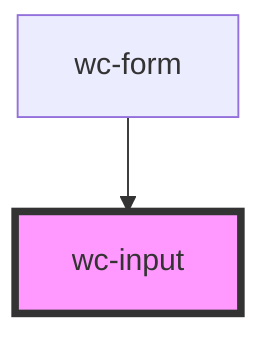

# wc-input

<!-- Auto Generated Below -->

## Properties

| Property   | Attribute  | Description | Type                            | Default      |
| ---------- | ---------- | ----------- | ------------------------------- | ------------ |
| `disabled` | `disabled` |             | `boolean`                       | `false`      |
| `label`    | `label`    |             | `string`                        | `'My Label'` |
| `type`     | `type`     |             | `"number" \| "range" \| "text"` | `'text'`     |

## Events

| Event         | Description | Type                                     |
| ------------- | ----------- | ---------------------------------------- |
| `inputChange` |             | `CustomEvent<{ [label: string]: any; }>` |

## Dependencies

### Used by

 - [wc-form](../wc-form)

### Graph

----------------------------------------------

*Built with [StencilJS](https://stenciljs.com/)*
